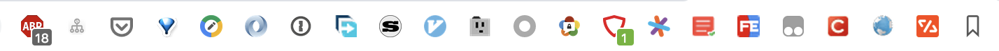

## 实用高效的 Chrome 插件推荐

整理了下常用的Chrome插件，大家有珍藏的好插件一定要多多分享哦！

## 增强类

1、[OneTab](https://chrome.google.com/webstore/detail/onetab/chphlpgkkbolifaimnlloiipkdnihall)

有时我们打开很多标签页一次看不完或者想保存起来下次接着看时，onetab就非常实用。再次访问这些标签页时，可以单独或全部恢复它们。

2、[Save to Pocket](https://chrome.google.com/webstore/detail/save-to-pocket/niloccemoadcdkdjlinkgdfekeahmflj)

可以收藏保存文章、图像、视频、链接等，支持多平台，相当于你随身的小口袋，必装插件。

3、[Vimium](https://chrome.google.com/webstore/detail/vimium/dbepggeogbaibhgnhhndojpepiihcmeb)

让你的 Chrome 摇身一变成 The Hacker's Browser，装逼神器不容置疑。[[Chrome神器Vimium使用]](https://chegva.com/2929.html)

4、[全能启动器 - Steward Plus](https://chrome.google.com/webstore/detail/steward-plus/dnkhdiodfglfckibnfcjbgddcgjgkacd)

启动器/便捷管理扩展/应用/标签/历史记录等，不占用 New Tab 版: Steward，功能很多丫。

5、[简悦 - SimpRead](http://ksria.com/simpread/)

让你瞬间进入沉浸式阅读的 Chrome 扩展，类似 Safari 的阅读模式。强迫症患者的福音！

6、[Google文档、表格及幻灯片的Office编辑扩展程序](https://chrome.google.com/webstore/detail/office-editing-for-docs-s/gbkeegbaiigmenfmjfclcdgdpimamgkj)

可以在 chrome 中查看和编辑Microsoft Word、Excel和PowerPoint文件 - 无需在您的计算机上安装Office，屌得一匹。

7、 [Free Download Manager](https://www.freedownloadmanager.org/zh/)

好用的开源下载器，比迅雷之流好不少啊。

8、[The Great Suspender](https://chrome.google.com/webstore/detail/the-great-suspender/klbibkeccnjlkjkiokjodocebajanakg)

冻结暂时用不到的标签页，以便释放系统资源，实用小工具。

9、[书签侧边栏](https://chrome.google.com/webstore/detail/bookmark-sidebar/jdbnofccmhefkmjbkkdkfiicjkgofkdh)

在浏览器侧边管理书签栏，体验还是不错的。

10、[自定义光标](https://chrome.google.com/webstore/detail/custom-cursor-for-chrome/ogdlpmhglpejoiomcodnpjnfgcpmgale)

Chrome 自定义光标,使用酷炫的免费鼠标光标自定义使用Chrome浏览器的体验。

11、[图片助手ImageAssistant](https://chrome.google.com/webstore/detail/imageassistant-batch-imag/dbjbempljhcmhlfpfacalomonjpalpko)

一款用于嗅探、分析网页图片并提供批量下载等功能及在线收藏、检索、分享服务的浏览器扩展程序。

12、[Fatkun图片批量下载](https://chrome.google.com/webstore/detail/fatkun-batch-download-ima/nnjjahlikiabnchcpehcpkdeckfgnohf)

找出当前页面的所有图片，提供按分辨率、链接等筛选图片，简单好用的下载图片扩展。

13、[Tree Style Histyle](https://chrome.google.com/webstore/detail/tree-style-history/khcenbpnhbeplojhaolbpldmoppicold)

树状展示浏览器历史 (For Edge / Chromium / Chrome)

14、[悬浮画中画播放器](https://chrome.google.com/webstore/detail/%E6%82%AC%E6%B5%AE%E7%94%BB%E4%B8%AD%E7%94%BB%E6%92%AD%E6%94%BE%E5%99%A8/gdcfkpenohoihodlddbcgpdjhmdjepnb?hl=zh-CN)

上班摸鱼神器，可以缩小放到屏幕角落的视频播放器。

## 工具类

1、[WEB前端助手(FeHelper)](https://chrome.google.com/webstore/detail/web前端助手fehelper/pkgccpejnmalmdinmhkkfafefagiiiad)

All In One的前端实用工具集，谁用谁知道！

2、[Tampermonkey](https://chrome.google.com/webstore/detail/tampermonkey/dhdgffkkebhmkfjojejmpbldmpobfkfo)

脚本运行神器，油管/b站视频随便下。

3、[WhatRuns](https://chrome.google.com/webstore/detail/whatruns/cmkdbmfndkfgebldhnkbfhlneefdaaip/related)

安装后可以点击WhatRuns图标来打开插件窗口，轻松了解网站的整体技术信息，我猜开发者应该是学霸。

4、[User-Agent Switcher](https://chrome.google.com/webstore/detail/user-agent-switcher/clddifkhlkcojbojppdojfeeikdkgiae)

User-Agent 用户代理工具，支持自定义，可自行添加，还是值得推荐的。

5、[JSONView](https://chrome.google.com/webstore/detail/jsonview/chklaanhfefbnpoihckbnefhakgolnmc)

通过浏览器就可直接查看JSON文件结构，层次的小而美插件。

6、[Octotree](https://chrome.google.com/webstore/detail/octotree/bkhaagjahfmjljalopjnoealnfndnagc)

玩 Github 必备插件，不需多言，用就是了。

7、[Sourcegraph](https://chrome.google.com/webstore/detail/sourcegraph/dgjhfomjieaadpoljlnidmbgkdffpack)

可以在 github 仓库中搜索想要的信息，不错。

8、[Enhanced GitHub](https://chrome.google.com/webstore/detail/enhanced-github/anlikcnbgdeidpacdbdljnabclhahhmd)

可以显示仓库和每个文件的大小，提供下载链接和复制文件内容的选项。

9、[IE Tab](https://chrome.google.com/webstore/detail/ie-tab/hehijbfgiekmjfkfjpbkbammjbdenadd)

在标签页中以IE内核显示网页,主要是政府，学校等一些网站用，mac上不需要安装虚拟机了，不过有点慢，需账号登陆下

10、[Video | GIF Downloader for Twitter](https://chrome.google.com/webstore/detail/video-gif-downloader-for/pkjcnglcgiacokoihlhjingbhhlbkjfn)

下载推特上的小视频和GIf

## 安全类

1、[Adblock Plus](https://chrome.google.com/webstore/detail/adblock-plus-free-ad-bloc/cfhdojbkjhnklbpkdaibdccddilifddb)

免费的广告拦截程序，享受没有恼人广告的网络世界，你值得拥有。

2、[Proxy SwitchyOmega](https://chrome.google.com/webstore/detail/proxy-switchyomega/padekgcemlokbadohgkifijomclgjgif)

轻松快捷地管理和切换多个代理设置。穿越GFW，幸福千万家。

3、[1password](https://1password.com/)

管理密码工具的扩展程序，可选的较多。

4、[WebRTC Leak Prevent](https://chrome.google.com/webstore/detail/webrtc-leak-prevent/eiadekoaikejlgdbkbdfeijglgfdalml)

防止Chrome中的WebRTC泄漏，FQ时暴露真实IP。[[关闭浏览器自带的 WebRTC 功能,防止暴露真实ip]](https://chegva.com/3338.html)

5、[Click&Clean](https://chrome.google.com/webstore/detail/clickclean/ghgabhipcejejjmhhchfonmamedcbeod)

关闭浏览器时清除浏览器隐私数据，历史记录等，功能不少，就是弹窗烦人，这点差评。

6、[Virus Total](https://chrome.google.com/webstore/detail/vt4browsers/efbjojhplkelaegfbieplglfidafgoka)

当你从网上下载某个文件前会弹出安全询问，或者右击某个超链接时，可以方便提交到 VT 进行扫描

7、[Ghelper](http://googlehelper.net/)

科学上网, for developers, cross-border workers, and research institutes to secure and speed Internet surfing.

8、[Authenticator](https://chrome.google.com/webstore/detail/authenticator/bhghoamapcdpbohphigoooaddinpkbai/relatedN)

身份验证器用以在浏览器中生成二步认证代码。Encrypting your secrets is strongly recommended, especially if you are logged into a Google account.

## Alfred Workflow

- [Chrome Bookmarks](https://github.com/blainesch/alfred-chrome-bookmarks)

- [Search Safari and Chrome Tabs](http://www.packal.org/workflow/search-safari-and-chrome-tabs)

`隐藏插件图标`：将鼠标移动到最右侧边上（添加书签的五角星的右侧），鼠标就会变成可拖动的双向箭头，这时单击并向右拖动，即可将插件图标逐个隐藏

#### 参考：

- [谷粒-Chrome插件英雄榜](https://github.com/zhaoolee/ChromeAppHeroes)

- [实用高效的 Alfred Workflows 收集推荐](https://github.com/anzhihe/Efficient-office/tree/master/Alfred-Workflows)

